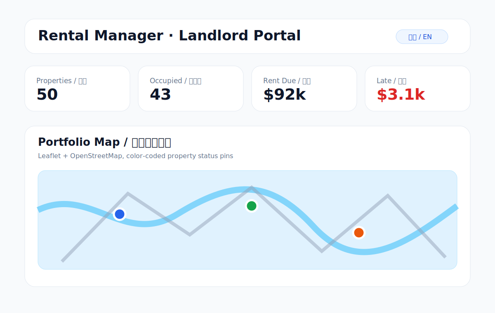
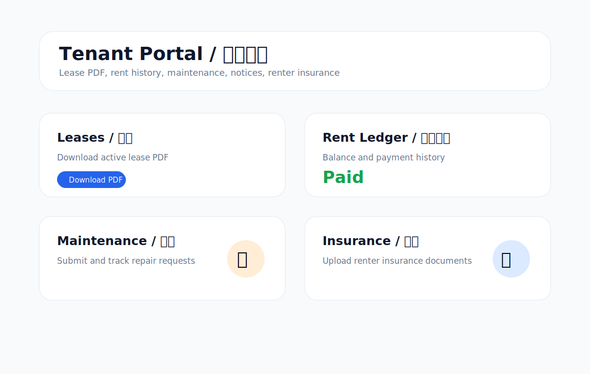
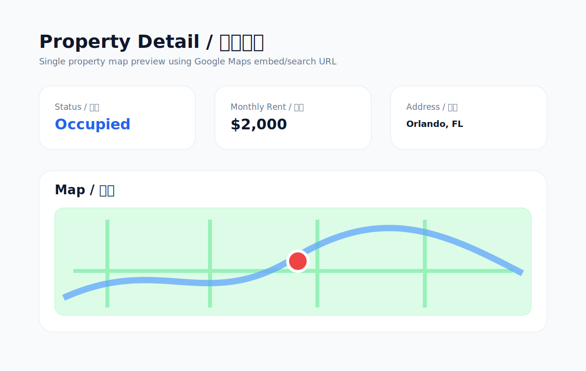

# Rental Manager

A bilingual English/Chinese rental-property management container for small Florida landlords managing roughly 20–50 rental homes. The project is inspired by the feature scope of MicroRealEstate, but intentionally built as a simpler Portainer-friendly application: one web app container plus PostgreSQL.



## Highlights

- **Landlord/Admin portal** for portfolio operations
- **Tenant portal** for lease downloads, rent history, maintenance requests, notices, and renter-insurance documents
- **Bilingual UI** with English/Chinese switching foundation
- **Portfolio map** using Leaflet + OpenStreetMap to show all rental properties with status-colored pins
- **Property detail map** using Google Maps embed/search URL without a Google API key
- **Florida long-term residential lease template** archived from the provided DOCX and prepared for PDF generation
- **Lease PDF generation pipeline** using `pdf-lib`
- **PostgreSQL + Prisma** data model
- **Docker/Portainer deployment**
- **GitHub Actions → GHCR image publishing**

## Current MVP Screens

### Landlord/Admin Dashboard

The Admin portal includes summary metrics, a portfolio map, and module cards for properties, tenants, leases, rent ledger, maintenance, and documents.


### Tenant Portal

The Tenant portal is designed for self-service access to lease PDFs, rent balance/history, maintenance requests, notices, and renter insurance uploads.



### Property Detail Map

Each property detail page can display a map using an address-based Google Maps embed/search URL. This first version requires no Google Maps API key.



## Technology Stack

- Next.js 16
- React 19
- TypeScript
- Tailwind CSS
- Prisma ORM
- PostgreSQL 16
- Leaflet + OpenStreetMap
- Google Maps URL embed for single-property views
- `pdf-lib` for PDF generation
- Docker multi-stage build
- GitHub Actions for GHCR publishing

## Repository Structure

```text
app/                         Next.js app routes
  landlord/                  Landlord/Admin portal
  tenant/                    Tenant portal
  api/                       Health and lease PDF endpoints
components/                  UI, map, and property components
lib/                         i18n, map helpers, Prisma, lease helpers
prisma/                      Database schema, migrations, seed script
templates/                   Lease template archive and extracted text
docs/images/                 README diagrams/screenshots
.github/workflows/           GHCR publish workflow
docs/github-actions/           Backup workflow template
Dockerfile                   Production image build
docker-compose.yml           Local Docker Compose
docker-compose.portainer.yml Portainer stack template
PORTAINER.md                 Deployment guide
README.zh-CN.md              Chinese README
```

## Lease Template

The provided Florida lease DOCX is archived at:

```text
templates/original/empty-florida-lease.docx
```

Extracted source text and operational Markdown template:

```text
templates/lease/florida-long-term-lease-source-extract.txt
templates/lease/florida-long-term-lease.md
```

> Legal note: the template should be reviewed by a Florida landlord-tenant attorney before production use.

## Data Model Overview

Initial Prisma models include:

- `User`
- `Property`
- `Tenant`
- `LeaseTemplate`
- `Lease`
- `LeaseTenant`
- `RentCharge`
- `RentPayment`
- `MaintenanceRequest`
- `Document`

`Property` includes optional `latitude` and `longitude` fields for the Admin portfolio map.

## Local Development

```bash
cp .env.example .env
npm install
npm run prisma:generate
npm run dev
```

Open:

```text
http://localhost:3000
```

Useful routes:

```text
/landlord
/tenant
/landlord/properties/demo
/api/health
/api/leases/demo/pdf
```

## Docker Image

Published image:

```text
ghcr.io/yonggangg/rental:latest
ghcr.io/yonggangg/rental:v0.1.0
```

Current `latest` image size:

```text
linux/amd64 pull size: about 316.1 MiB
Decimal size: about 331.5 MB
Layers: 16
```

Portainer's first pull will download roughly 330 MB, plus the PostgreSQL image if it is not already present on the server.

Local build:

```bash
docker build -t rental:test .
```

## Portainer Deployment

Use the provided `docker-compose.portainer.yml` as a Portainer Stack.

### Required environment variables

```env
APP_URL=https://your-domain.example.com
NEXTAUTH_URL=https://your-domain.example.com
NEXTAUTH_SECRET=replace-with-long-random-secret
POSTGRES_DB=rental
POSTGRES_USER=rental
POSTGRES_PASSWORD=replace-with-strong-password
ADMIN_EMAIL=admin@example.com
ADMIN_PASSWORD=replace-with-temporary-admin-password
ADMIN_NAME=Landlord Admin
```

Generate a strong secret:

```bash
openssl rand -base64 32
```

### Environment variable reference

| Variable | Purpose |
| --- | --- |
| `APP_URL` | Public URL of the app, for example `https://rental.yourdomain.com` or `http://server-ip:3000` during testing. |
| `NEXTAUTH_URL` | URL used by NextAuth for login/session callbacks. Usually the same as `APP_URL`. It must be accurate once authentication is enabled. |
| `NEXTAUTH_SECRET` | Long random secret used to sign/encrypt auth sessions and tokens. Generate it with `openssl rand -base64 32`. |
| `POSTGRES_DB` | PostgreSQL database name. Default example: `rental`. |
| `POSTGRES_USER` | PostgreSQL username. Default example: `rental`. |
| `POSTGRES_PASSWORD` | PostgreSQL password. Use a strong password, especially on an internet-accessible server. |
| `ADMIN_EMAIL` | Initial admin account email seeded on first deployment. |
| `ADMIN_PASSWORD` | Initial admin password. Use a temporary strong password and change it once account management is implemented. |
| `ADMIN_NAME` | Display name for the initial admin user, for example `Landlord Admin`. |

### YAML quoting recommendation

In Docker Compose / Portainer YAML, quoting environment values is recommended, especially for URLs, secrets, passwords, and values containing spaces or special characters such as `:`, `#`, `$`, `@`, or `!`.

Recommended YAML style:

```yaml
environment:
  APP_URL: "https://your-domain.example.com"
  NEXTAUTH_URL: "https://your-domain.example.com"
  NEXTAUTH_SECRET: "replace-with-long-random-secret"
  POSTGRES_DB: "rental"
  POSTGRES_USER: "rental"
  POSTGRES_PASSWORD: "replace-with-strong-password"
  ADMIN_EMAIL: "admin@example.com"
  ADMIN_PASSWORD: "replace-with-temporary-admin-password"
  ADMIN_NAME: "Landlord Admin"
```

If you fill values in Portainer's Environment Variables table UI, enter the raw values without quote characters.

### Portainer steps

1. Open **Portainer → Stacks → Add stack**.
2. Name the stack `rental`.
3. Paste the contents of `docker-compose.portainer.yml`.
4. Add the required environment variables.
5. Deploy the stack.
6. Open `APP_URL` or the mapped port, for example `http://server-ip:3000`.

If the GHCR package is public, Portainer does not need registry credentials. If you later make it private, add a `ghcr.io` registry credential in Portainer.

More details are in [PORTAINER.md](PORTAINER.md).

## GitHub Release and GHCR

The workflow at `.github/workflows/docker-ghcr.yml` publishes images to:

```text
ghcr.io/yonggangg/rental
```

On pushes to `main`, it publishes:

- `latest`
- `sha-<commit>`

On version tags such as `v0.1.0`, it also publishes the tag image.

## Current Status

This is an active MVP. It now includes password-protected landlord and tenant portals, core CRUD pages for properties, tenants, leases, rent charges, maintenance requests, documents, and lease templates, plus map views and a lease PDF pipeline. Remaining production work includes polished edit forms, file upload storage, rent automation, tenant-submitted maintenance forms, and attorney-reviewed full lease rendering.

## License

No open-source license has been selected yet. Unless the repository owner adds a license later, all rights are reserved by default.
