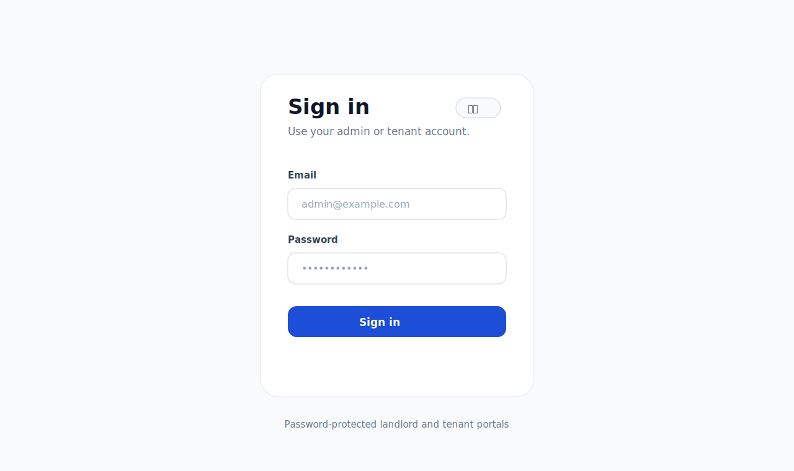
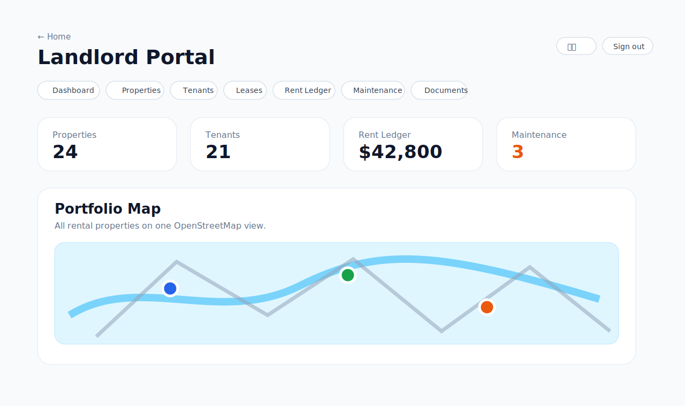
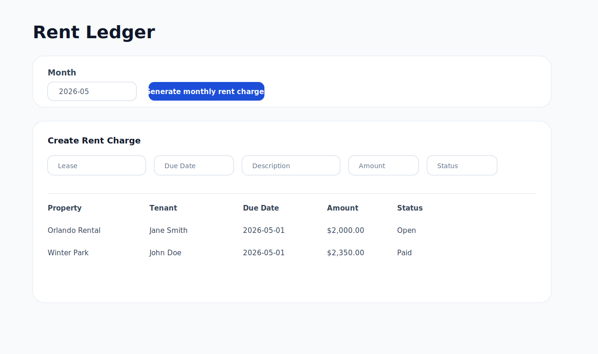
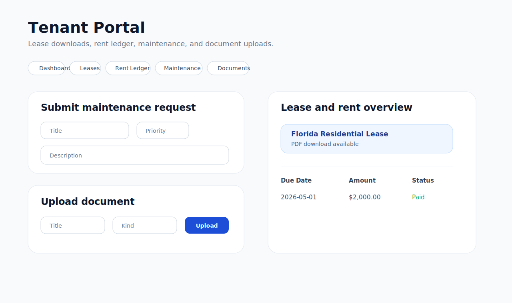
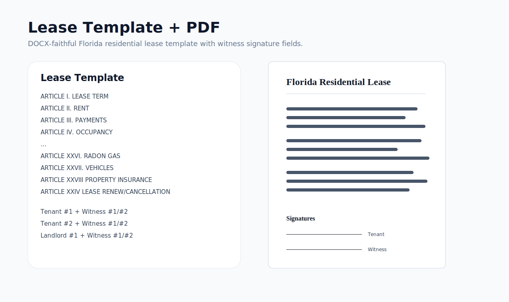

# Rental Manager 出租屋管理系统

这是一个面向 Florida 小型房东的中英双语出租屋管理 Container 项目，适合管理约 20–50 套出租屋。项目功能范围参考 MicroRealEstate，但架构刻意保持简单：一个 Web App container + 一个 PostgreSQL 数据库，方便用 Portainer 部署。



## 主要功能

- **Landlord/Admin Portal 房东后台**：管理房屋、租客、租约、租金、维修和文件
- **Tenant Portal 租客门户**：租客查看/下载 lease PDF、查看租金记录、提交维修、查看通知、上传 renter insurance
- **中英双语界面基础**：支持 English / 中文切换
- **房源总览地图**：用 Leaflet + OpenStreetMap 在 Admin 页面显示所有出租屋位置，不需要 Google API key
- **单个房屋地图**：Property 详情页用 Google Maps 地址嵌入/搜索链接显示地图，也不需要 Google API key
- **Florida 长租住宅 Lease 模板**：已归档你提供的 DOCX，并提取整理成模板素材
- **Lease PDF 生成管线**：使用 `pdf-lib` 生成 PDF
- **PostgreSQL + Prisma 数据模型**
- **Docker / Portainer 部署**
- **GitHub Actions 自动发布 GHCR image**

## 当前界面图文

### 登录页面

房东后台和租客门户都需要登录。界面支持通过 `?lang=en` / `?lang=zh` 切换英文或中文，同一页面不会中英文混杂。


### 房东/Admin 仪表盘

Admin 页面包含关键指标、Leaflet/OpenStreetMap 房源总览地图，以及房屋、租客、租约、租金账本、维修、文件、租约模板等模块入口。



### Admin CRUD 与月租账单生成

Admin 页面已经提供核心记录的创建/更新基础能力；租金账本可以根据 active leases 生成当月 rent charges。



### 租客自助门户

Tenant Portal 支持租客查看/下载 lease PDF、查看租金记录、提交维修请求，并上传 renter insurance 等文件。



### Lease 模板与 PDF 渲染

Florida lease 模板已按你提供的 DOCX 段落顺序重新生成，保留提取出的 article 内容，并加入租客/房东 witness 签名字段。



## 技术栈

- Next.js 16
- React 19
- TypeScript
- Tailwind CSS
- Prisma ORM
- PostgreSQL 16
- Leaflet + OpenStreetMap
- Google Maps 地址嵌入链接
- `pdf-lib` PDF 生成
- Docker multi-stage build
- GitHub Actions 发布 GHCR

## 项目结构

```text
app/                         Next.js 路由
  landlord/                  房东/Admin 后台
  tenant/                    租客门户
  api/                       Health 和 Lease PDF API
components/                  UI、地图、房屋组件
lib/                         i18n、地图 helper、Prisma、lease helper
prisma/                      数据库 schema、migration、seed
templates/                   Lease 模板归档和提取文本
docs/images/                 README 截图/图文素材
.github/workflows/           GHCR 发布 workflow
Dockerfile                   生产镜像构建
docker-compose.yml           本地 Docker Compose
docker-compose.portainer.yml Portainer Stack 模板
PORTAINER.md                 部署说明
README.md                    英文 README
```

## Lease 模板

原始 Florida lease DOCX 归档在：

```text
templates/original/empty-florida-lease.docx
```

提取文本和 Markdown 模板在：

```text
templates/lease/florida-long-term-lease-source-extract.txt
templates/lease/florida-long-term-lease.md
```

> 法律提醒：正式投入使用前，建议请 Florida landlord-tenant attorney 审阅 lease 模板，尤其是 late fee、security deposit、eviction notice、repair charge 等条款。

## 数据模型概览

初版 Prisma 模型包括：

- `User`
- `Property`
- `Tenant`
- `LeaseTemplate`
- `Lease`
- `LeaseTenant`
- `RentCharge`
- `RentPayment`
- `MaintenanceRequest`
- `Document`

`Property` 已包含可选字段：

```text
latitude
longitude
```

用于 Admin 房源总览地图。

## 本地开发

```bash
cp .env.example .env
npm install
npm run prisma:generate
npm run dev
```

打开：

```text
http://localhost:3000
```

常用路径：

```text
/landlord
/tenant
/landlord/properties/demo
/api/health
/api/leases/demo/pdf
```

## Docker Image

发布镜像：

```text
ghcr.io/yonggangg/rental:latest
ghcr.io/yonggangg/rental:v0.3.2
```

当前 `latest` 镜像大小：

```text
linux/amd64 pull size: 约 326.5 MiB
十进制大小：约 342.4 MB
Layers: 16
```

Portainer 第一次 pull 大约会下载 340 MB；如果服务器还没有 PostgreSQL 镜像，还会额外下载 PostgreSQL image。

本地构建：

```bash
docker build -t rental:test .
```

## 用 Portainer 部署

使用项目里的 `docker-compose.portainer.yml` 创建 Portainer Stack。

### 必填环境变量

```env
APP_URL=https://your-domain.example.com
NEXTAUTH_URL=https://your-domain.example.com
NEXTAUTH_SECRET=replace-with-long-random-secret
POSTGRES_DB=rental
POSTGRES_USER=rental
POSTGRES_PASSWORD=replace-with-strong-password
ADMIN_EMAIL=admin@example.com
ADMIN_PASSWORD=replace-with-temporary-admin-password
ADMIN_NAME=Landlord Admin
```

生成 secret：

```bash
openssl rand -base64 32
```

### 环境变量说明

| 变量 | 作用 |
| --- | --- |
| `APP_URL` | 应用的公开访问地址，例如 `https://rental.yourdomain.com`；测试时也可以用 `http://server-ip:3000`。 |
| `NEXTAUTH_URL` | NextAuth 登录/session callback 使用的地址，通常和 `APP_URL` 相同。启用登录后这个值必须准确。 |
| `NEXTAUTH_SECRET` | 用于签名/加密登录 session 和 token 的长随机密钥。可用 `openssl rand -base64 32` 生成。 |
| `POSTGRES_DB` | PostgreSQL 数据库名称，示例值：`rental`。 |
| `POSTGRES_USER` | PostgreSQL 用户名，示例值：`rental`。 |
| `POSTGRES_PASSWORD` | PostgreSQL 密码。建议使用强密码，尤其是公网服务器部署时。 |
| `ADMIN_EMAIL` | 首次部署时 seed 的 admin 账号邮箱。 |
| `ADMIN_PASSWORD` | 首次 admin 密码。建议使用临时强密码，并在账号管理功能完善后更换。 |
| `ADMIN_NAME` | 初始 admin 显示名称，例如 `Landlord Admin`。 |

### YAML 是否需要加引号？

建议在 Docker Compose / Portainer YAML 里给环境变量值加引号，尤其是 URL、secret、password，以及包含空格或特殊字符的值，例如 `:`, `#`, `$`, `@`, `!`。

推荐 YAML 写法：

```yaml
environment:
  APP_URL: "https://your-domain.example.com"
  NEXTAUTH_URL: "https://your-domain.example.com"
  NEXTAUTH_SECRET: "replace-with-long-random-secret"
  POSTGRES_DB: "rental"
  POSTGRES_USER: "rental"
  POSTGRES_PASSWORD: "replace-with-strong-password"
  ADMIN_EMAIL: "admin@example.com"
  ADMIN_PASSWORD: "replace-with-temporary-admin-password"
  ADMIN_NAME: "Landlord Admin"
```

如果是在 Portainer 的 Environment Variables 表格界面里填写，通常不要输入引号，直接填写原始值即可。

### Portainer 操作步骤

1. 打开 **Portainer → Stacks → Add stack**。
2. Stack 名称填写 `rental`。
3. 粘贴 `docker-compose.portainer.yml` 内容。
4. 填入上面的环境变量。
5. 点击 Deploy。
6. 打开 `APP_URL`，或用服务器 IP + 端口访问，例如：`http://server-ip:3000`。

如果 GHCR package 是 Public，Portainer 不需要 registry 登录。如果以后改成 Private，则需要在 Portainer 里添加 `ghcr.io` registry credential。

更多细节见 [PORTAINER.md](PORTAINER.md)。

## GitHub Release 与 GHCR

`.github/workflows/docker-ghcr.yml` 会发布 image 到：

```text
ghcr.io/yonggangg/rental
```

push 到 `main` 时发布：

- `latest`
- `sha-<commit>`

创建版本 tag，例如 `v0.1.0` 时，也会发布对应版本 image。

## 当前状态

这是正在完善中的 MVP。当前已经包含：带密码保护的房东和租客门户、房屋/租客/租约/租金账单/维修/文件/租约模板核心 CRUD 页面、地图视图和 lease PDF 生成管线。本版本新增文件上传存储、租客提交维修、月租账单生成、更完整的 lease PDF 渲染和服务端更新 actions。后续生产化工作还包括更精细的逐条编辑页面、付款流程、角色管理界面，以及经律师审阅后的 lease 文案。

## License

尚未选择开源许可证。除非仓库 owner 后续添加 license，否则默认保留所有权利。
